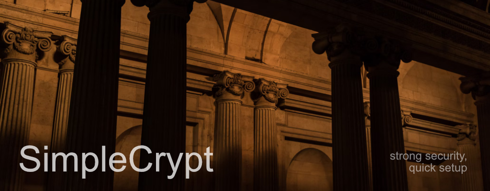

# Documentation

## Overview
**SimpleCrypt** is a lightweight terminal-based tool for encrypting and decrypting files and directories using **AES-256** encryption. Packaged as a shell script (`simplecrypt.sh`), it offers a simple and secure method for protecting sensitive data directly from the command line. With password-based encryption using **Argon2id** for enhanced security, user-friendly logging, and backup functionalities, SimpleCrypt makes security easier to manage.

---

**Important**: for some errors of mine, the versions before **SimpleCrypt v1.2** are no longer available.

---

## Features

- **File Encryption/Decryption**: Encrypt individual files with AES-256 encryption and decrypt them securely when needed.
- **Directory Encryption/Decryption**: Encrypt or decrypt entire directories, enabling batch processing of multiple files.
- **Alias Commands**: Simple aliases (`nc`, `dc`, `ncdir`, `dcdir`) make encryption and decryption faster and more intuitive.
- **Argon2id Key Derivation**: Utilizes **Argon2id**, a state-of-the-art memory-hard password-hashing algorithm, providing even stronger protection compared to PBKDF2.
- **Secure Logging**: Encryption and decryption activities are logged in `$HOME/file_encryption.log`, ensuring traceability.
- **Password Complexity Checks**: Ensures that passwords meet specified complexity requirements to enhance security.
- **Password via Environment Variable**: Supports the `$PASSWORD` environment variable for secure, non-interactive operations.
- **Silent and Verbose Modes**: New logging flexibility with silent (`-s`) and verbose (`-v`) options.
- **Custom Temporary Directory**: Uses a specified `TMPDIR` for improved management of temporary files.
- **Enhanced Error Handling**: Specific exit codes and improved error messages for better user feedback.

---

## Getting Started

### Prerequisites

Ensure your system has the following tools installed:

- **OpenSSL**: For encryption and decryption.
- **jq**: For handling JSON data during encryption.

To install these dependencies:
```bash
sudo apt install openssl jq
```

### Installation

1. Clone the repository:
    ```bash
    git clone https://github.com/alessgorgo/SimpleCrypt.git
    ```

2. Navigate into the project directory:
    ```bash
    cd SimpleCrypt
    ```

3. Make the script executable:
    ```bash
    chmod +x simplecrypt.sh
    ```

4. Optionally, move it to your `/usr/local/bin` for global access:
    ```bash
    sudo mv simplecrypt.sh /usr/local/bin/SimpleCrypt
    ```

---

## Usage

SimpleCrypt provides various operations for file and directory encryption/decryption. Here's how to use them:

### Command Structure

```bash
./SimpleCrypt.sh {operation} {file/directory} [options]
```

### Operations

| Command        | Description                                        |
|----------------|----------------------------------------------------|
| `nc`           | Encrypt a file.                                    |
| `dc`           | Decrypt a file.                                    |
| `ncdir`        | Encrypt all files in a directory.                   |
| `dcdir`        | Decrypt all files in a directory.                   |
| `encrypt`      | Alias for `nc`. Encrypt a file.                     |
| `decrypt`      | Alias for `dc`. Decrypt a file.                     |
| `encrypt-dir`  | Alias for `ncdir`. Encrypt all files in a directory.|
| `decrypt-dir`  | Alias for `dcdir`. Decrypt all files in a directory.|

### Example Usage

#### Encrypt a File

```bash
./SimpleCrypt.sh nc myfile.txt
```

You will be prompted for a passkey to encrypt the file.

#### Decrypt a File

```bash
./SimpleCrypt.sh dc myfile.txt
```

Provide the same passkey used during encryption.

#### Encrypt All Files in a Directory

```bash
./SimpleCrypt.sh ncdir /path/to/myfolder
```

#### Decrypt All Files in a Directory

```bash
./SimpleCrypt.sh dcdir /path/to/myfolder
```

---

## Options

### Password Handling

By default, SimpleCrypt will prompt for a password interactively. To securely pass a password using the `$PASSWORD` environment variable, you can do so like this:

```bash
export PASSWORD="my_secret_password"
./SimpleCrypt.sh nc myfile.txt
```

### Password Complexity Checks

To enhance security, passwords must meet specific complexity criteria, such as minimum length, inclusion of numbers, special characters, and uppercase/lowercase letters.

### Silent and Verbose Modes

- Use `-s` for silent mode to suppress output.
- Use `-v` for verbose mode for detailed logging.

Example:

```bash
./SimpleCrypt.sh nc myfile.txt -v
```

### Logging

Encryption and decryption actions are logged in:

```bash
$HOME/file_encryption.log
```

To locate the log directory:

```bash
./SimpleCrypt.sh --log-dir
```

---

## Security Features

1. **AES-256 Encryption**: SimpleCrypt uses AES-256-CBC to secure data, a widely regarded and secure encryption method.
2. **Argon2id Key Derivation**: Passkeys are derived using **Argon2id**, a memory-hard algorithm that offers better resistance against brute-force attacks compared to PBKDF2.
3. **Password Complexity Checks**: Passwords are validated for strength before processing.
4. **Password via Environment Variable**: The `$PASSWORD` environment variable can be used to securely pass passwords for automated operations.
5. **Encrypted Data in JSON**: Encrypted files now store their initialization vector (IV) within a JSON format for better portability.

---

## Error Handling

### Common Errors and Solutions

- **`openssl: Extra (unknown) options: "kdf_iter" "100000"`**  
  Ensure your OpenSSL version supports Argon2id. If it’s outdated, you may need to upgrade OpenSSL.

- **`mktemp: mkstemp failed on /dev/shm/...`**  
  Verify that the `/dev/shm/` directory exists and has appropriate permissions, or modify the `mktemp` command to use another directory.

- **`Decryption failed. Please check your password.`**  
  This error usually occurs if the incorrect password is provided.

---

## FAQ

### Can I use this script on Windows?

SimpleCrypt is designed for Unix-based systems (Linux and macOS). On Windows, you can use WSL (Windows Subsystem for Linux) to run SimpleCrypt.

### How secure is my data?

SimpleCrypt uses AES-256-CBC encryption, recognized as highly secure. The Argon2id key derivation function further strengthens the protection by making password guessing significantly harder. The security of your passkey is critical to ensure full protection.

### Can I automate encryption tasks?

Yes, by using the `$PASSWORD` environment variable, you can automate file encryption and decryption in scripts without needing interactive password input.

---

## License

SimpleCrypt is licensed under the MIT License. See the [LICENSE](./LICENSE) file for more details.

---

## Changelog

### Release v1.3-beta.1

+ Implemented Argon2id-based key derivation for enhanced security.
+ Generated random salt and IV for stronger encryption.
+ Updated encryption to use AES-256-CBC with OpenSSL.
+ Enhanced debug messages for tracing encryption processes.
+ Refactored key derivation and encryption logic.
+ Improved error handling and logging.
