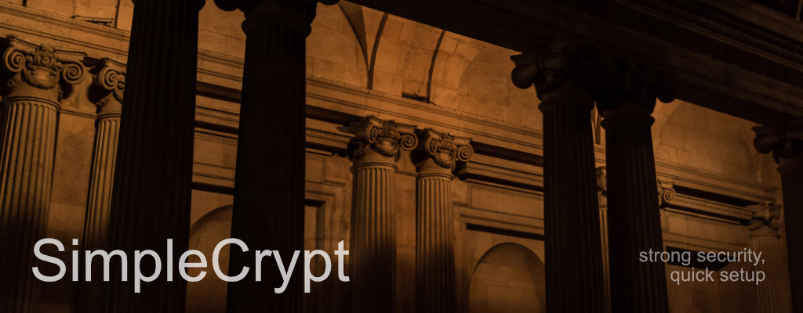

<a href="https://github.com/alessgorgo/SimpleCrypt/releases"></a>
<a href="https://github.com/alessgorgo/SimpleCrypt/blob/SimpleCrypt-log/LICENSE"></a>
<a href="https://github.com/alessgorgo/SimpleCrypt/stargazers"></a> <br>
  
# SimpleCrypt v1.5

A multi-algorithm file encryption tool built in Rust with a cross-platform GUI.

SimpleCrypt encrypts and decrypts files using modern authenticated encryption algorithms. It runs on macOS, Windows, and Linux as both a command-line tool and a native desktop application.

## Features

- **4 encryption algorithms** — choose the right balance of speed and security
- **Cross-platform GUI** — native desktop app built with Tauri v2 and Svelte
- **Command-line interface** — scriptable CLI with `clap` for automation and power users
- **Configurable defaults** — TOML config file for algorithm, theme, and behavior preferences
- **Backward compatible** — decrypts files created by SimpleCrypt v1.x
- **Secure by design** — PBKDF2 key derivation, memory zeroization, constant-time comparisons, atomic file writes

## Supported Algorithms

| Algorithm | Type | Best For |
|---|---|---|
| **AES-256-GCM** (default) | AEAD | General use, hardware-accelerated on modern CPUs |
| AES-256-CBC | HMAC-SHA256 | Legacy compatibility with v1.x files |
| ChaCha20-Poly1305 | AEAD | Devices without AES hardware instructions |
| XChaCha20-Poly1305 | AEAD | Maximum nonce safety (24-byte nonce) |

All algorithms use PBKDF2-SHA256 for key derivation with adaptive iteration counts based on file size (10,000–600,000 iterations).

## Project Structure

```
SimpleCrypt/
  Cargo.toml                  # Workspace root
  simplecrypt-core/           # Shared encryption library
  simplecrypt-cli/            # Command-line interface
  simplecrypt-gui/            # Tauri v2 desktop application
```

## Prerequisites

- [Rust](https://rustup.rs/) (1.70+)
- [Node.js](https://nodejs.org/) (18+) — for the GUI frontend only
- OpenSSL development libraries (for AES-256-CBC legacy support)

### Platform-specific dependencies

**macOS:**
```bash
brew install openssl
```

**Ubuntu/Debian:**
```bash
sudo apt install libssl-dev libwebkit2gtk-4.1-dev libappindicator3-dev librsvg2-dev
```

**Windows:**

Install OpenSSL via [vcpkg](https://vcpkg.io/) or download prebuilt binaries. Tauri requires WebView2 (included in Windows 10/11).

## Building

### Build everything

```bash
cargo build --workspace
```

### Build only the CLI

```bash
cargo build -p simplecrypt-cli
```

### Build only the GUI

```bash
cd simplecrypt-gui/frontend && npm install && cd ../..
cargo build -p simplecrypt-gui
```

### Build for release

```bash
cargo build --workspace --release
```

The release binary is at `target/release/simplecrypt`.

## Usage — Command Line

### Encrypt a file

```bash
# Uses default algorithm (AES-256-GCM) — prompts for password
simplecrypt encrypt myfile.txt

# Specify algorithm and password inline
simplecrypt encrypt myfile.txt "mypassword" --algorithm chacha20-poly1305

# Create a backup before overwriting
simplecrypt encrypt myfile.txt --backup
```

### Decrypt a file

```bash
# Auto-detects algorithm from the encrypted file
simplecrypt decrypt myfile.txt

# With password inline
simplecrypt decrypt myfile.txt "mypassword"
```

### Encrypt/decrypt a directory

```bash
simplecrypt encrypt-dir ./documents "mypassword" --algorithm aes-256-gcm
simplecrypt decrypt-dir ./documents "mypassword"
```

### Preview without changes

```bash
simplecrypt encrypt myfile.txt --dry-run
```

### List available algorithms

```bash
simplecrypt algorithms
```

Output:
```
Available encryption algorithms:

  aes-256-cbc            AES-256-CBC (Legacy) (key: 32B, nonce: 16B, requires HMAC)
  aes-256-gcm            AES-256-GCM (key: 32B, nonce: 12B, AEAD)
  chacha20-poly1305      ChaCha20-Poly1305 (key: 32B, nonce: 12B, AEAD)
  xchacha20-poly1305     XChaCha20-Poly1305 (key: 32B, nonce: 24B, AEAD)
```

### View or change configuration

```bash
# Show current config
simplecrypt config --show

# Change default algorithm
simplecrypt config --set encryption.algorithm=chacha20-poly1305

# Enable auto-backup
simplecrypt config --set security.backup_on_encrypt=true

# Change theme
simplecrypt config --set ui.theme=dark
```

## Usage — GUI

### Run in development mode

```bash
cd simplecrypt-gui/frontend && npm install && cd ..
cargo tauri dev
```

### Build distributable packages

```bash
cargo tauri build
```

This produces platform-native packages:
- **macOS:** `.dmg`
- **Windows:** `.msi`
- **Linux:** `.AppImage`, `.deb`

### GUI features

- File and directory picker with drag-and-drop
- Password input field
- Algorithm selector dropdown
- Encrypt / Decrypt buttons
- Settings panel (default algorithm, theme, auto-backup)
- Operation status messages

## Configuration

SimpleCrypt stores its config as TOML at the platform-specific location:

| Platform | Path |
|---|---|
| macOS | `~/Library/Application Support/SimpleCrypt/config.toml` |
| Linux | `~/.config/simplecrypt/config.toml` |
| Windows | `%APPDATA%\SimpleCrypt\config.toml` |

Default configuration:

```toml
[encryption]
algorithm = "aes-256-gcm"
iterations = "adaptive"

[security]
secure_wipe = true
backup_on_encrypt = false

[ui]
theme = "system"
```

## Encrypted File Format

SimpleCrypt v1.5 writes **v3.0** JSON envelopes:

```json
{
  "version": "3.0",
  "algorithm": "aes-256-gcm",
  "salt": "<base64>",
  "nonce": "<base64>",
  "data": "<base64>",
  "hmac": "<base64 or null>"
}
```

- `algorithm` — identifies which cipher was used
- `hmac` — present only for non-AEAD algorithms (AES-256-CBC); AEAD algorithms embed authentication in the ciphertext
- Decryption auto-detects v1.0 formats

## Running Tests

```bash
# Run all tests
cargo test --workspace

# Run core library tests only (21 tests)
cargo test -p simplecrypt-core
```

Tests cover:
- Round-trip encrypt/decrypt for all 4 algorithms
- Backward compatibility with v1.5 format
- Wrong password rejection
- Tampered data detection
- Cross-algorithm mismatch detection
- Empty, large, and Unicode data handling
- Config save/load round-trip

## Security

- **Key derivation:** PBKDF2-SHA256 with adaptive iterations (10K–600K based on file size)
- **Memory safety:** Sensitive data (keys, passwords) zeroized after use via the `zeroize` crate
- **Tamper detection:** HMAC-SHA256 for CBC mode; built-in authentication tags for AEAD modes
- **Timing attack prevention:** Constant-time comparisons for HMAC verification
- **File permissions:** Encrypted files set to `0600` (owner read/write only) on Unix
- **Atomic writes:** Large files written via temp file + rename to prevent corruption

## License

This project is licensed under the MIT License. See the LICENSE file for details.
